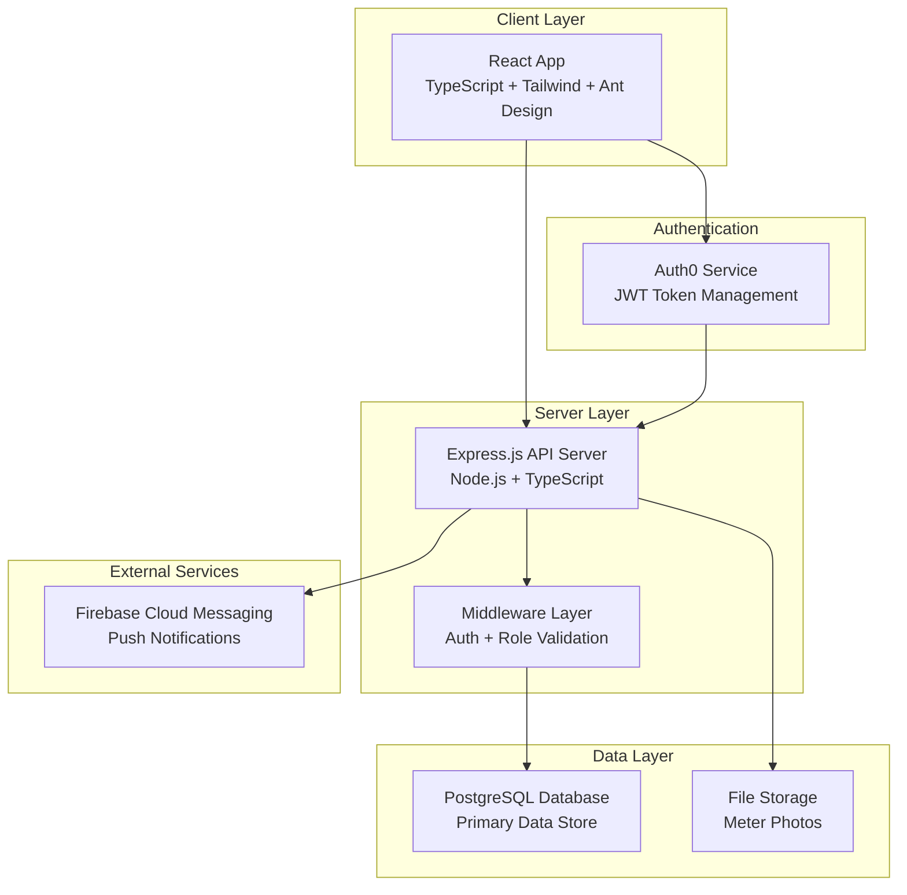
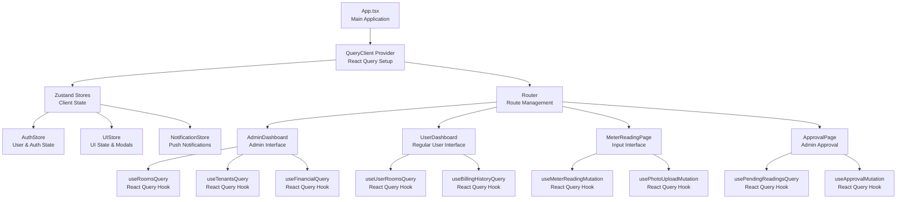
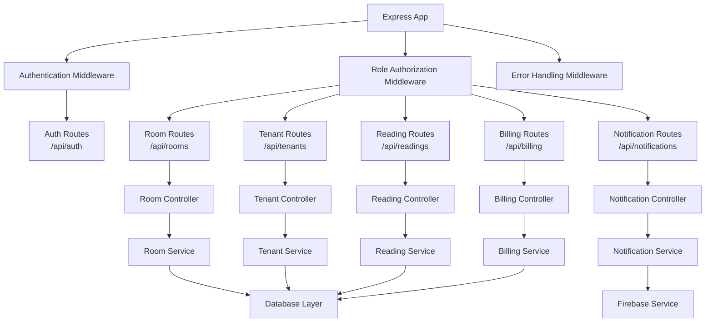

# Design Document

## Overview

The Rental Management Application is a full-stack web application designed to manage a single building with 18 rental rooms across 2 floors. The system provides role-based access control, meter reading management with photo verification, approval workflows, and comprehensive financial tracking. The application follows a modern architecture with React/TypeScript frontend and Node.js/Express backend, integrated with Auth0 for authentication and Firebase for push notifications.

## Architecture

### High-Level Architecture



### Technology Stack

**Frontend (Client)**
- React 18 with TypeScript
- Tailwind CSS for styling
- Ant Design for UI components
- React Router for navigation
- Axios for API communication
- Zustand for state management
- React Query (TanStack Query) for server state management, data fetching, and caching

**Backend (Server)**
- Node.js with Express.js framework
- TypeScript for type safety
- JWT middleware for authentication
- Multer for file upload handling
- PostgreSQL with Prisma ORM
- Firebase Admin SDK for push notifications

**Database**
- PostgreSQL for relational data
- File system or cloud storage for meter photos

**External Services**
- Auth0 for authentication and user management
- Firebase Cloud Messaging for push notifications

## Components and Interfaces

### Frontend State Management Architecture



### Key Frontend Components & State Management

1. **Zustand Stores**
   ```typescript
   // Auth Store
   interface AuthStore {
     user: User | null;
     isAuthenticated: boolean;
     token: string | null;
     login: (token: string, user: User) => void;
     logout: () => void;
     updateUser: (user: Partial<User>) => void;
   }
   
   // UI Store
   interface UIStore {
     sidebarCollapsed: boolean;
     activeModal: string | null;
     loading: Record<string, boolean>;
     toggleSidebar: () => void;
     openModal: (modalId: string) => void;
     closeModal: () => void;
     setLoading: (key: string, loading: boolean) => void;
   }
   
   // Notification Store
   interface NotificationStore {
     notifications: Notification[];
     unreadCount: number;
     addNotification: (notification: Notification) => void;
     markAsRead: (id: string) => void;
     clearAll: () => void;
   }
   ```

2. **React Query Hooks**
   ```typescript
   // Data fetching hooks
   const useRoomsQuery = () => useQuery(['rooms'], fetchRooms);
   const useTenantsQuery = (roomId?: number) => useQuery(['tenants', roomId], () => fetchTenants(roomId));
   const useMeterReadingsQuery = (roomId: number) => useQuery(['readings', roomId], () => fetchReadings(roomId));
   
   // Mutation hooks
   const useMeterReadingMutation = () => useMutation(submitReading, {
     onSuccess: () => queryClient.invalidateQueries(['readings'])
   });
   const useApprovalMutation = () => useMutation(approveReading, {
     onSuccess: () => queryClient.invalidateQueries(['readings', 'pending'])
   });
   ```

3. **Key Components**
   - **AuthProvider**: Manages Auth0 integration with Zustand auth store
   - **RoleBasedRoute**: Uses auth store for role-based routing
   - **MeterReadingForm**: Uses React Query mutations and UI store for form state
   - **ApprovalInterface**: Uses React Query for data fetching and mutations
   - **NotificationHandler**: Integrates Firebase with notification store

### Backend API Architecture



### API Endpoints

**Authentication & Users**
- `POST /api/auth/login` - Auth0 token validation
- `GET /api/auth/profile` - Get user profile and role
- `POST /api/auth/refresh` - Refresh JWT token

**Room Management**
- `GET /api/rooms` - List rooms (filtered by user role)
- `GET /api/rooms/:id` - Get room details
- `PUT /api/rooms/:id` - Update room (admin only)
- `GET /api/rooms/:id/tenants` - Get room tenants

**Tenant Management**
- `GET /api/tenants` - List tenants (filtered by user access)
- `POST /api/tenants` - Create tenant (admin only)
- `PUT /api/tenants/:id` - Update tenant (admin only)
- `DELETE /api/tenants/:id` - Remove tenant (admin only)

**Meter Readings**
- `GET /api/readings/room/:roomId` - Get room reading history
- `POST /api/readings` - Submit new readings
- `PUT /api/readings/:id` - Modify pending readings
- `GET /api/readings/pending` - Get pending approvals (admin)
- `POST /api/readings/:id/approve` - Approve readings (admin)
- `POST /api/readings/:id/reject` - Reject readings (admin)

**Billing**
- `GET /api/billing/room/:roomId` - Get room billing history
- `POST /api/billing/calculate` - Calculate bill amount
- `GET /api/billing/reports` - Financial reports (admin)

**File Upload**
- `POST /api/upload/meter-photo` - Upload meter photos
- `GET /api/files/:filename` - Retrieve uploaded files

## Data Models

### Database Schema

```sql
-- Users table (synced with Auth0)
CREATE TABLE users (
    id UUID PRIMARY KEY,
    auth0_id VARCHAR(255) UNIQUE NOT NULL,
    email VARCHAR(255) NOT NULL,
    name VARCHAR(255) NOT NULL,
    role VARCHAR(50) NOT NULL CHECK (role IN ('admin', 'user')),
    created_at TIMESTAMP DEFAULT CURRENT_TIMESTAMP,
    updated_at TIMESTAMP DEFAULT CURRENT_TIMESTAMP
);

-- Rooms table (18 predefined rooms)
CREATE TABLE rooms (
    id SERIAL PRIMARY KEY,
    room_number INTEGER NOT NULL UNIQUE CHECK (room_number BETWEEN 1 AND 18),
    floor INTEGER NOT NULL CHECK (floor IN (1, 2)),
    base_rent DECIMAL(10,2) DEFAULT 0,
    max_tenants INTEGER DEFAULT 4,
    created_at TIMESTAMP DEFAULT CURRENT_TIMESTAMP,
    updated_at TIMESTAMP DEFAULT CURRENT_TIMESTAMP
);

-- Tenants table
CREATE TABLE tenants (
    id UUID PRIMARY KEY DEFAULT gen_random_uuid(),
    name VARCHAR(255) NOT NULL,
    email VARCHAR(255),
    phone VARCHAR(50),
    room_id INTEGER REFERENCES rooms(id),
    move_in_date DATE,
    move_out_date DATE,
    is_active BOOLEAN DEFAULT true,
    created_at TIMESTAMP DEFAULT CURRENT_TIMESTAMP,
    updated_at TIMESTAMP DEFAULT CURRENT_TIMESTAMP
);

-- User room assignments (for regular users)
CREATE TABLE user_room_assignments (
    id UUID PRIMARY KEY DEFAULT gen_random_uuid(),
    user_id UUID REFERENCES users(id),
    room_id INTEGER REFERENCES rooms(id),
    assigned_at TIMESTAMP DEFAULT CURRENT_TIMESTAMP,
    UNIQUE(user_id, room_id)
);

-- Meter readings table
CREATE TABLE meter_readings (
    id UUID PRIMARY KEY DEFAULT gen_random_uuid(),
    room_id INTEGER REFERENCES rooms(id) NOT NULL,
    month INTEGER NOT NULL CHECK (month BETWEEN 1 AND 12),
    year INTEGER NOT NULL,
    water_reading DECIMAL(10,1) NOT NULL,
    electricity_reading DECIMAL(10,1) NOT NULL,
    water_photo_url VARCHAR(500),
    electricity_photo_url VARCHAR(500),
    base_rent DECIMAL(10,2) NOT NULL,
    trash_fee DECIMAL(10,2) DEFAULT 52000,
    total_amount DECIMAL(10,2),
    status VARCHAR(20) DEFAULT 'pending' CHECK (status IN ('pending', 'approved', 'rejected')),
    submitted_by UUID REFERENCES users(id),
    submitted_at TIMESTAMP DEFAULT CURRENT_TIMESTAMP,
    approved_by UUID REFERENCES users(id),
    approved_at TIMESTAMP,
    UNIQUE(room_id, month, year)
);

-- Reading modification log
CREATE TABLE reading_modifications (
    id UUID PRIMARY KEY DEFAULT gen_random_uuid(),
    reading_id UUID REFERENCES meter_readings(id),
    modified_by UUID REFERENCES users(id),
    modified_at TIMESTAMP DEFAULT CURRENT_TIMESTAMP,
    field_name VARCHAR(100) NOT NULL,
    old_value TEXT,
    new_value TEXT,
    modification_type VARCHAR(50) NOT NULL CHECK (modification_type IN ('create', 'update', 'approve', 'reject'))
);

-- Billing history
CREATE TABLE billing_records (
    id UUID PRIMARY KEY DEFAULT gen_random_uuid(),
    reading_id UUID REFERENCES meter_readings(id),
    room_id INTEGER REFERENCES rooms(id),
    month INTEGER NOT NULL,
    year INTEGER NOT NULL,
    water_usage DECIMAL(10,1),
    electricity_usage DECIMAL(10,1),
    water_cost DECIMAL(10,2),
    electricity_cost DECIMAL(10,2),
    base_rent DECIMAL(10,2),
    trash_fee DECIMAL(10,2),
    total_amount DECIMAL(10,2),
    payment_status VARCHAR(20) DEFAULT 'unpaid' CHECK (payment_status IN ('unpaid', 'paid', 'overdue')),
    payment_date DATE,
    created_at TIMESTAMP DEFAULT CURRENT_TIMESTAMP
);

-- Notification log
CREATE TABLE notifications (
    id UUID PRIMARY KEY DEFAULT gen_random_uuid(),
    user_id UUID REFERENCES users(id),
    title VARCHAR(255) NOT NULL,
    message TEXT NOT NULL,
    type VARCHAR(50) NOT NULL,
    read_status BOOLEAN DEFAULT false,
    created_at TIMESTAMP DEFAULT CURRENT_TIMESTAMP
);
```

### TypeScript Interfaces

```typescript
// User and Authentication
interface User {
  id: string;
  auth0Id: string;
  email: string;
  name: string;
  role: 'admin' | 'user';
  createdAt: Date;
  updatedAt: Date;
}

// Room Management
interface Room {
  id: number;
  roomNumber: number;
  floor: 1 | 2;
  baseRent: number;
  maxTenants: number;
  currentTenants: Tenant[];
  occupancyCount: number;
  createdAt: Date;
  updatedAt: Date;
}

interface Tenant {
  id: string;
  name: string;
  email?: string;
  phone?: string;
  roomId: number;
  room?: Room;
  moveInDate?: Date;
  moveOutDate?: Date;
  isActive: boolean;
  createdAt: Date;
  updatedAt: Date;
}

// Meter Readings
interface MeterReading {
  id: string;
  roomId: number;
  room?: Room;
  month: number;
  year: number;
  waterReading: number;
  electricityReading: number;
  waterPhotoUrl?: string;
  electricityPhotoUrl?: string;
  baseRent: number;
  trashFee: number;
  totalAmount?: number;
  status: 'pending' | 'approved' | 'rejected';
  submittedBy: string;
  submittedAt: Date;
  approvedBy?: string;
  approvedAt?: Date;
  modifications: ReadingModification[];
}

interface ReadingModification {
  id: string;
  readingId: string;
  modifiedBy: string;
  modifiedAt: Date;
  fieldName: string;
  oldValue?: string;
  newValue?: string;
  modificationType: 'create' | 'update' | 'approve' | 'reject';
  user?: User;
}

// Billing
interface BillingRecord {
  id: string;
  readingId: string;
  roomId: number;
  month: number;
  year: number;
  waterUsage: number;
  electricityUsage: number;
  waterCost: number;
  electricityCost: number;
  baseRent: number;
  trashFee: number;
  totalAmount: number;
  paymentStatus: 'unpaid' | 'paid' | 'overdue';
  paymentDate?: Date;
  createdAt: Date;
}

// Notifications
interface Notification {
  id: string;
  userId: string;
  title: string;
  message: string;
  type: string;
  readStatus: boolean;
  createdAt: Date;
}

// API Response Types
interface ApiResponse<T> {
  success: boolean;
  data?: T;
  error?: string;
  message?: string;
}

interface PaginatedResponse<T> extends ApiResponse<T[]> {
  pagination: {
    page: number;
    limit: number;
    total: number;
    totalPages: number;
  };
}
```

## Error Handling

### Frontend Error Handling

1. **API Error Interceptor**
   - Centralized error handling for all API calls
   - Automatic token refresh on 401 errors
   - User-friendly error messages
   - Logging for debugging

2. **Form Validation**
   - Real-time validation for meter readings
   - Photo upload validation (size, format)
   - Decimal precision validation
   - Required field validation

3. **Error Boundaries**
   - React error boundaries for component crashes
   - Fallback UI for broken components
   - Error reporting to logging service

### Backend Error Handling

1. **Global Error Middleware**
   - Centralized error processing
   - Structured error responses
   - Error logging and monitoring
   - Security-safe error messages

2. **Validation Middleware**
   - Request body validation using Joi or Zod
   - File upload validation
   - Role-based access validation
   - Database constraint validation

3. **Custom Error Classes**
   ```typescript
   class AppError extends Error {
     statusCode: number;
     isOperational: boolean;
     
     constructor(message: string, statusCode: number) {
       super(message);
       this.statusCode = statusCode;
       this.isOperational = true;
     }
   }
   
   class ValidationError extends AppError {
     constructor(message: string) {
       super(message, 400);
     }
   }
   
   class AuthorizationError extends AppError {
     constructor(message: string = 'Unauthorized') {
       super(message, 403);
     }
   }
   ```

## Testing Strategy

### Frontend Testing

1. **Unit Tests**
   - Component testing with React Testing Library
   - Utility function testing with Jest
   - Custom hook testing
   - Form validation testing

2. **Integration Tests**
   - API integration testing with MSW (Mock Service Worker)
   - User flow testing
   - Authentication flow testing
   - File upload testing

3. **E2E Tests**
   - Critical user journeys with Playwright or Cypress
   - Admin approval workflow
   - Meter reading submission flow
   - Billing calculation verification

### Backend Testing

1. **Unit Tests**
   - Service layer testing
   - Utility function testing
   - Validation logic testing
   - Calculation formula testing

2. **Integration Tests**
   - API endpoint testing with Supertest
   - Database integration testing
   - Authentication middleware testing
   - File upload testing

3. **Database Tests**
   - Model validation testing
   - Constraint testing
   - Migration testing
   - Seed data testing

### Test Data Management

1. **Test Database**
   - Separate test database instance
   - Automated test data seeding
   - Database cleanup between tests
   - Transaction rollback for isolation

2. **Mock Services**
   - Auth0 service mocking
   - Firebase service mocking
   - File storage mocking
   - External API mocking

## Security Considerations

### Authentication & Authorization

1. **JWT Token Management**
   - Secure token storage (httpOnly cookies)
   - Token expiration and refresh
   - Role-based access control
   - Session management

2. **API Security**
   - CORS configuration
   - Rate limiting
   - Request validation
   - SQL injection prevention

### Data Protection

1. **File Upload Security**
   - File type validation
   - File size limits
   - Virus scanning
   - Secure file storage

2. **Data Validation**
   - Input sanitization
   - XSS prevention
   - CSRF protection
   - SQL injection prevention

### Privacy & Compliance

1. **Data Encryption**
   - Sensitive data encryption at rest
   - HTTPS for data in transit
   - Database connection encryption
   - File storage encryption

2. **Audit Logging**
   - User action logging
   - Data modification tracking
   - Access attempt logging
   - Security event monitoring

## Performance Optimization

### Frontend Performance

1. **Code Splitting**
   - Route-based code splitting
   - Component lazy loading
   - Dynamic imports for heavy components
   - Bundle size optimization

2. **Caching Strategy**
   - React Query for server state caching and synchronization
   - Zustand persist middleware for client state persistence
   - Image caching for meter photos
   - Static asset caching
   - Service worker implementation

3. **UI Optimization**
   - Virtual scrolling for large lists
   - Image optimization and lazy loading
   - Debounced search inputs
   - Optimistic updates

### Backend Performance

1. **Database Optimization**
   - Proper indexing strategy
   - Query optimization
   - Connection pooling
   - Database caching

2. **API Optimization**
   - Response compression
   - Pagination for large datasets
   - Efficient data serialization
   - Background job processing

3. **File Handling**
   - Image compression
   - CDN for file delivery
   - Efficient file storage
   - Thumbnail generation

## Deployment Architecture

### Development Environment
- Local development with Docker Compose
- Hot reloading for both frontend and backend
- Local PostgreSQL instance
- Mock external services

### Production Environment
- Containerized deployment with Docker
- Load balancer for high availability
- Database clustering
- CDN for static assets
- Monitoring and logging services

### CI/CD Pipeline
- Automated testing on pull requests
- Code quality checks
- Security scanning
- Automated deployment to staging
- Manual approval for production deployment